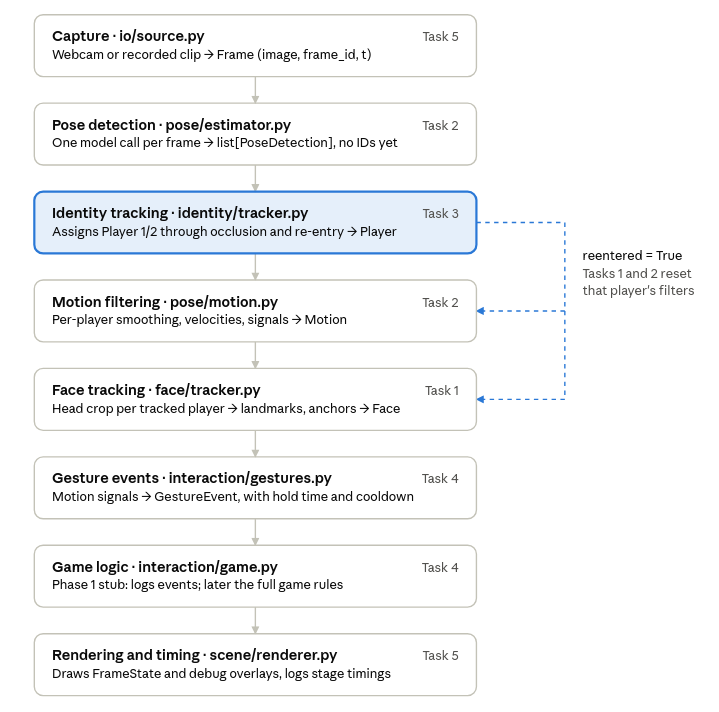
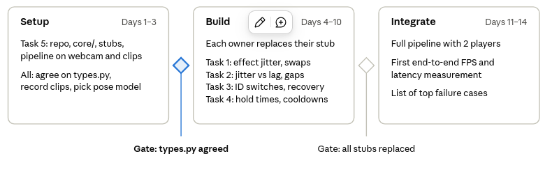

Sep 28, 2026 · @el created with help of Claude Opus 5.5

> This is the original plan. For what is built now and what each owner does next, see [status.md](status.md).

## Purpose and scope

For the next two weeks we build face tracking, motion and gesture tracking, and multiplayer identity tracking inside one shared codebase. The final game will grow out of this same codebase, so it is set up for all five tasks from day one.

The key rule: we agree on the **interfaces between modules** first. What each module takes in and returns is fixed in `core/types.py`. After that, each person works on their own module in parallel, without waiting for anyone else.

When the game design is final, adding it means filling in the Task 4 game logic and the Task 5 renderer. It should not mean rewriting phase 1.

## Pipeline order

Task 2 is split into two halves, with Task 3 in between, because smoothing needs a stable player identity to keep filter state per player.


If keypoints were smoothed before identities were assigned, two players' keypoints would get mixed whenever they cross. The same holds for face-effect stability in Task 1.

Two rules follow from this order. First, the pose model runs **once per frame**; no module opens its own camera or runs its own full-frame person detector. Second, Task 1 finds each face from the head region of an already-tracked body, so face-to-player association comes almost for free. Task 1 may still detect faces on the full frame and match them to bodies, as long as it returns the `Face` format below.

## Repository layout

Each task owns one package under `src/ipcvgame/`. Task 5 owns `core/`, `io/`, `scene/` and `app/`, which everyone else builds on.

```
ipcv-game/
├── README.md
├── requirements.txt            # pinned versions
├── configs/
│   └── default.yaml            # every threshold, one section per module
├── src/ipcvgame/
│   ├── core/                   # Task 5 — shared contracts, changes need team agreement
│   │   ├── types.py            # dataclasses passed between modules
│   │   ├── skeleton.py         # canonical keypoint names/indices (e.g. COCO-17)
│   │   ├── filters.py          # One Euro, EMA, Kalman helpers (shared by Tasks 1–3)
│   │   ├── geometry.py         # bbox IoU, crops, coordinate conversions
│   │   ├── timing.py           # per-stage profiler
│   │   └── config.py
│   ├── io/                     # Task 5
│   │   ├── source.py           # Webcam and VideoFile behind one interface
│   │   └── recorder.py         # record test clips + per-frame CSV logs
│   ├── pose/                   # Task 2
│   │   ├── estimator.py        # model wrapper + adapter to canonical skeleton
│   │   └── motion.py           # per-player smoothing, velocities, signals
│   ├── identity/               # Task 3
│   │   └── tracker.py
│   ├── face/                   # Task 1
│   │   ├── tracker.py
│   │   └── effects.py          # face-anchored AR effects
│   ├── interaction/            # Task 4
│   │   ├── gestures.py         # motion signals → GestureEvent
│   │   └── game.py             # stub in phase 1
│   ├── scene/                  # Task 5
│   │   └── renderer.py
│   └── app/                    # Task 5
│       ├── pipeline.py         # wires modules together
│       └── main.py
├── tools/
│   ├── run_module.py           # run the pipeline up to one module, with its debug overlay
│   └── eval_*.py               # per-task evaluation scripts
├── tests/
└── data/clips/                 # recorded test videos (gitignored, shared via drive)
```

`core/filters.py` is shared on purpose: Tasks 1, 2 and 3 all need smoothing or Kalman filtering, and one tested implementation beats three copies.

## Shared data contracts (`core/types.py`)

These dataclasses are the only thing modules share; everything else is internal to its owner. We agree on them in the first meeting, and changes afterwards need a team heads-up.

```python
@dataclass
class Frame:
    image: np.ndarray          # BGR, already mirrored, full resolution
    frame_id: int
    t: float                   # capture time, time.perf_counter()

@dataclass
class PoseDetection:           # Task 2 (pose detection) output, NO identity
    bbox: np.ndarray           # (4,) x1, y1, x2, y2 in pixels
    kpts: np.ndarray           # (K, 2) pixels, canonical skeleton order
    conf: np.ndarray           # (K,)
    score: float

@dataclass
class Player:                  # Task 3 output
    pid: int                   # 1, 2, ...
    status: str                # "active" | "occluded" | "lost"
    det: PoseDetection | None  # None when occluded or lost
    bbox: np.ndarray           # predicted box when det is None
    pos: np.ndarray            # (x, depth) estimate in metres, stub OK for now
    reentered: bool            # True on the frame a lost player comes back

@dataclass
class Motion:                  # Task 2 (motion filtering) output, per player
    kpts: np.ndarray           # smoothed
    vel: np.ndarray            # px/s
    valid: np.ndarray          # (K,) bool, keypoint trustworthy this frame
    signals: dict[str, float]  # "r_wrist_speed", "hands_above_head", ...

@dataclass
class Face:                    # Task 1 output, per player
    pid: int
    valid: bool
    landmarks: np.ndarray | None
    center: np.ndarray
    scale: float
    roll: float
    yaw: float
    anchors: dict[str, np.ndarray]   # "above_head", "forehead", "mouth"

@dataclass
class GestureEvent:            # Task 4 output
    pid: int
    name: str
    t: float
    conf: float

@dataclass
class FrameState:              # everything for one frame, read by game + renderer
    frame: Frame
    players: dict[int, Player]
    motion: dict[int, Motion]
    faces: dict[int, Face]
    events: list[GestureEvent]
    timings: dict[str, float]
```

Five conventions are built into these types:

- **Coordinates and mirroring.** All coordinates are pixels in the full-resolution, mirrored frame. We mirror once, at capture, so "left" means the same thing to players and code.
- **Timestamps.** Every filter uses the real `t`, not a frame count. FPS will vary, and One Euro and Kalman filters need the true time step.
- **Canonical skeleton.** `skeleton.py` defines names such as `L_WRIST`, and everyone indexes by name. The pose adapter converts whatever model we use (YOLO's COCO-17, MediaPipe's 33) into this format, so Task 2 can swap models without breaking Tasks 1, 3 and 4.
- **Face anchors.** Tasks 4 and 5 never touch raw landmarks. They draw at `faces[pid].anchors["above_head"]` and similar points.
- **The `reentered` flag.** Task 3 uses it to tell Tasks 1 and 2 to reset their filters for that player. Without it, smoothing drags a returning player's keypoints in from where they left.

## Module interface and main loop

Every module has the same four methods, so the pipeline only glues them together:

- `__init__(cfg)` reads its own section of `configs/default.yaml`.
- `update(...)` takes the types above and returns its own output type.
- `reset(pid=None)` clears state for one player, or for all players.
- `draw_debug(canvas, state)` draws the module's internals: confidences, track IDs, raw versus smoothed keypoints.

```python
for frame in source:
    with prof("pose"):     dets    = pose.detect(frame)
    with prof("identity"): players = identity.update(dets, frame)
    with prof("motion"):   motion  = motion_filter.update(players, frame.t)
    with prof("face"):     faces   = face.update(frame, players)
    with prof("gesture"):  events  = gestures.update(motion, frame.t)
    state = FrameState(frame, players, motion, faces, events, prof.last())
    with prof("game"):     game.update(state)          # stub: logs events
    with prof("render"):   canvas = renderer.draw(state, game)
```

**Start with stubs.** On day one, every module gets a trivial stand-in so the whole pipeline runs end to end. The pose stub is the only real model call. Each owner then replaces their stub without anyone waiting on them, and a broken module can be swapped back to its stub via config.

| Module | Phase 1 stub |
| --- | --- |
| Pose detection | Real pretrained model, adapter to canonical skeleton |
| Identity | Player 1 = left half of screen, Player 2 = right half |
| Motion | Passes keypoints through, velocities by finite difference |
| Face | Returns an `above_head` anchor above the nose keypoint |
| Gestures | Returns no events |
| Game | Prints events to the console |

**Develop in isolation.** `tools/run_module.py --until identity --source data/clips/crossing.mp4` runs the pipeline up to one module and shows that module's debug overlay. Each person can work and test on recorded clips without the rest of the game.

## Team conventions

**Record shared test clips in week 1.** `Webcam` and `VideoFile` share one interface, so every module can run on recorded video. With two people and the same setup, we record:

- Normal play
- Players crossing positions
- One player occluding the other
- A player leaving and re-entering the frame
- Fast arm movements
- Poor lighting

Everyone develops and evaluates on these same clips, so results are reproducible. Task 3 hand-labels who is who in them to count identity switches. Without the clips, the report's evaluation sections can't be written.

**Keep thresholds out of code.** Every threshold, filter parameter and cooldown lives in `configs/default.yaml`, with a comment on why it has that value. Each of us has to justify our parameters in the individual questions.

**Time and log from day one.** The profiler records per-stage milliseconds every frame. The recorder writes one CSV per run with `frame_id`, `t`, stage timings, and per-player status and position; owners add their own columns. This is the evidence for FPS, latency and bottlenecks in the report.

**Stay single-threaded for now.** The pipeline runs sequentially, and modules keep no hidden global state. Later we will likely move camera capture to a background thread that keeps only the latest frame. That is easy if every module just takes a `Frame` in and returns its result.

**Git rules.**

- `main` is protected; each task works on its own branch and merges through a pull request that Task 5 reviews.
- Any change to `core/types.py` needs a heads-up to the whole team, because it affects everyone.
- Model weights and videos stay out of the repo; the README lists exact download commands (also required for the final ZIP).

**Environment.** We pin one Python version that every member's machine can install all dependencies on, and check this in week 1. We also decide early which laptop runs the live demo, since performance is judged there.

## Ownership and two-week plan

Each task has one owner and one phase 1 deliverable; fill in the names.

| Task | Owner | Modules | Phase 1 deliverable |
| --- | --- | --- | --- |
| 1 Face tracking |  | `face/tracker.py`, `face/effects.py` | Stable AR effect on each player's face, no swaps between players |
| 2 Pose and motion |  | `pose/estimator.py`, `pose/motion.py` | Smoothed keypoints and motion signals per player |
| 3 Identity |  | `identity/tracker.py` | Stable Player 1/2 through crossing, occlusion and re-entry |
| 4 Interaction |  | `interaction/gestures.py`, `interaction/game.py` (stub) | Gesture events with hold times and cooldowns |
| 5 Integration | @el | `core/`, `io/`, `scene/`, `app/`, `tools/` | Running pipeline, shared clips, timing logs, code review |


The first gate matters most: once `types.py` is agreed, nobody waits on anyone else. Each owner finishes phase 1 with one evaluation script run on the shared clips, and those results become the backbone of the report.