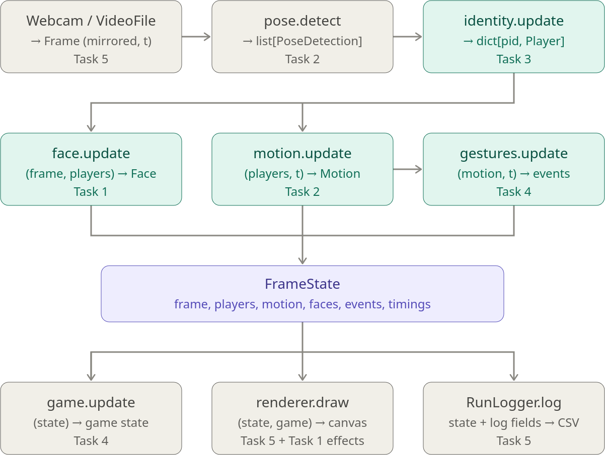

Sep 28, 2026 · @el created with help of Claude Opus 5.5

# Phase 1 status: what exists, what each of us does next

The phase-1 skeleton from the [setup guide](setup-guide.md) now runs end to end on the webcam and on recorded clips. Task 5 code (`core/`, `io/`, `scene/`, `app/`, `tools/`) is complete for phase 1. Every other module is a **stub** that follows the contracts, so each owner can replace their stub without waiting for anyone.

This document covers what the pipeline looks like right now, what your stub does and what you need to deliver, and the open items the team still has to fill in.

## Where we are

| Area | Owner | State | Notes |
| --- | --- | --- | --- |
| `core/` contracts, skeleton, filters, timing, config | Task 5 | Done | `types.py` is exactly the agreed contract |
| `io/source.py` webcam + video file | Task 5 | Done | Mirrored at capture; clips replay real timestamps |
| `io/recorder.py` clips + CSV logs | Task 5 | Done | One CSV per run in `logs/` |
| `scene/` renderer (OpenCV) | Task 5 | Phase-1 version | Moves to `pygame-ce` once the game is designed |
| `app/pipeline.py`, `app/main.py`, `tools/` | Task 5 | Done | `--until <stage>` for per-module debugging |
| `pose/estimator.py` | Task 2 | Stub (real model) | YOLO26n-pose, ~10 ms/frame on the RTX 3070 Ti |
| `pose/motion.py` | Task 2 | Stub | No smoothing, no signals |
| `identity/tracker.py` | Task 3 | Stub | Left half = P1, right half = P2 |
| `face/tracker.py`, `face/effects.py` | Task 1 | Stub | No face model; dot above the nose |
| `interaction/gestures.py`, `interaction/game.py` | Task 4 | Stub | No events; game prints events |

Tests: 18 passing (`pytest`), lint clean (`ruff check src tests tools`).

## Architecture as built

### One frame through the pipeline



All of this lives in `Pipeline.step()` in `src/ipcvgame/app/pipeline.py`. It runs on one thread, in this fixed order, and each stage is timed by the profiler.

### Conventions the code already enforces

- **Mirroring happens once, in the source.** Every coordinate you receive is a pixel in the mirrored full-resolution frame. Clips are stored *raw* and mirrored on load, the same as the webcam.
- **Time comes from `Frame.t` in seconds.** For a live webcam that is `perf_counter()` at capture. For clips it is replayed from the `<clip>.timestamps.csv` sidecar, so your filters see the same dt as they did live. Never use frame counts as time.
- **Keypoints are in canonical COCO-17 order.** Index them by name (`from ipcvgame.core import skeleton as sk; kpts[sk.L_WRIST]`). YOLO outputs COCO-17 directly; `skeleton.FROM_MEDIAPIPE33` maps MediaPipe's 33 points if Task 2 switches models.
- **Re-entry resets.** When `Player.reentered` is True, `MotionFilter` clears that player's state itself, and the pipeline calls `face.reset(pid)`. Keep this behaviour when you replace a stub.
- **Model warm-up.** The pipeline runs one dummy frame through the model at startup, so the ~3 s CUDA initialisation never shows up as a gap between frames 0 and 1.

### The module interface

Every module has the same methods; replace the body, keep the signature.

| Method | Purpose |
| --- | --- |
| `__init__(cfg)` | Receives *its own* section of `configs/default.yaml` |
| `update(...)` | Typed inputs → its own output type (pose uses `detect(frame)`) |
| `reset(pid=None)` | Clear state for one player, or all when `pid` is None |
| `draw_debug(canvas, state)` | Draw your internals; shown with `--until <your stage>` |
| `log_fields(state) -> dict` *(optional)* | Extra CSV columns; prefix keys with your module, e.g. `face_p1_roll` |

`log_fields` is new since the setup guide. It is optional and does not touch `types.py`.

### Shared code you should use rather than rewrite

- `core/filters.py`: `OneEuro`, `EMA` and `ConstantVelocityKalman`. They work on any array shape (e.g. `(17, 2)` keypoints) and take the real `t`. They are tested, including a test that the result does not depend on the FPS.
- `core/geometry.py`: `bbox_iou`, `bbox_center`, `clip_bbox`, `crop` (returns the crop plus the offset back to full-frame pixels).
- `scene/draw.py`: `player_color(pid)`, `draw_skeleton`, `draw_bbox`, `draw_text`, so debug views use the same colours everywhere.

### Config

`configs/default.yaml` has one section per module: `source`, `pose`, `identity`, `motion`, `face`, `gestures`, `game`, `recorder`, `render`. Every threshold goes in your section with a comment explaining its value. You can override any value from the command line without editing the file: `--set identity.num_players=2`.

One cross-section read exists today: `FaceTracker` receives `motion.kpt_conf_threshold` for deciding whether the nose keypoint is trustworthy. Task 1 may replace this with its own key in `face:`.

### Measured performance (demo candidate: RTX 3070 Ti)

| Stage | ms/frame |
| --- | --- |
| pose (YOLO26n-pose, fp16) | ~10 |
| identity, motion, face, gesture, game (stubs) | < 0.1 each |
| render | ~1 |
| **total** | **~11** |

The pipeline itself could run at ~90 FPS. In the first live test, the webcam delivered only ~15 fps (68 ms between frames), which is likely auto-exposure in dim light. This needs checking before we record the shared clips (see Task 5 below).

## How to work on your module

```bash
conda activate ipcvgame                       # setup: see README.md
python tools/run_module.py --until identity --source data/clips/crossing.mp4
python -m ipcvgame.app.main                   # full game view on the webcam
pytest                                        # before every PR
```

1. Branch from `main` (`task1-face`, `task2-pose`, …). Only edit your own package and your config section.
2. Replace the stub body; keep class names, method signatures and output types.
3. Add unit tests for your module under `tests/` (`tests/test_pipeline.py` shows how to feed fake detections without a model).
4. Add `log_fields` for anything you will want to plot in the report.
5. Write `tools/eval_<task>.py` that runs on the shared clips and prints your metric.
6. Open a PR; Task 5 reviews. Changes to `core/types.py` need a heads-up to everyone first.

## What each person has to do

### Task 1: Face tracking and AR — owner: ____________

**Stub today:** `FaceTracker.update` puts `center` on the nose keypoint and sets `scale` to the shoulder width. Its only anchor is `above_head`, placed 0.9 × scale above the nose. It sets `landmarks=None` and `roll = yaw = 0`. `FaceEffects.draw` draws a coloured dot at `above_head`.

**To deliver:** a stable AR effect on each player's face, with no swaps between players.

- Real face model; the recommended one is MediaPipe Face Landmarker, one instance per player on the head crop taken from that player's keypoints or box.
- Fill every `Face` field: `landmarks`, `center`, `scale`, `roll`, `yaw`, `valid`.
- Anchors at least `above_head`, `forehead`, `mouth` (Tasks 4 and 5 only ever draw at anchors).
- Smoothing on anchors or pose parameters (not all 478 landmarks) with `core/filters.py`; reset on `reset(pid)`.
- Real sprite effects in `FaceEffects.draw` (alpha blending, rotation by roll, scaling by scale).
- Thresholds in `face:`; `log_fields` (e.g. `face_p1_valid`, `face_p1_roll`); `tools/eval_face.py`.

### Task 2: Pose and motion — owner: ____________

**Stub today:** `PoseEstimator` runs YOLO26n-pose (`models/yolo26n-pose.pt`, downloaded automatically) and converts its output to canonical keypoints. `MotionFilter` passes keypoints through unsmoothed, computes velocity by finite difference on `t`, sets `valid = conf ≥ 0.5`, and returns `signals = {}`.

**To deliver:** smoothed keypoints and motion signals per player.

- Choose and justify the model and its size (YOLO26 vs YOLO11, n vs s) on the shared clips; keep the adapter to canonical order.
- Per-player, per-keypoint smoothing (One Euro and/or Kalman from `core/filters.py`); state keyed by `pid`, cleared on `reentered`.
- Confidence gating: hold the last valid value for a short time when a keypoint drops out.
- Define the `signals` Task 4 needs (e.g. `r_wrist_speed`, `hands_above_head`). **Agree the names with Task 4.**
- Thresholds in `pose:` / `motion:`; `log_fields` (raw vs smoothed jitter); `tools/eval_motion.py`.

### Task 3: Identity tracking — owner: ____________

**Stub today:** P1 is the best-scoring detection whose box centre is in the left half of the screen, and P2 the best in the right half. A player with no detection keeps their last box with `status="lost"`, and gets `reentered=True` when a detection returns. There is no prediction, so crossing swaps the IDs, and `pos` is always `(0, 0)`.

**To deliver:** stable Player 1 / Player 2 through crossing, occlusion and re-entry.

- Own tracker: Kalman box prediction, Hungarian matching (`scipy.optimize.linear_sum_assignment`), colour-histogram appearance for re-entry.
- Use all three statuses: `active`, `occluded` (predicted box, `det=None`), `lost`; set `reentered` exactly on the returning frame.
- `pos` as `(x, depth)` in metres (calibration from shoulder width or box height).
- Baseline comparison with Ultralytics ByteTrack.
- Hand-label who is who in the shared clips; `tools/eval_identity.py` counts ID switches.
- Thresholds in `identity:`; `log_fields` (match cost, histogram distance).

### Task 4: Interaction — owner: ____________

**Stub today:** `GestureRecognizer.update` returns `[]`. Its `draw_debug` already shows each player's motion signals and the frame's events. `Game.update` prints events to the console.

**To deliver:** gesture events with hold times and cooldowns.

- Rule-based gestures on `Motion` (angles, distances normalised by shoulder width, velocities).
- Per-player state machine (idle → charging → fired → cooldown) with hold times and hysteresis; all in `gestures:`.
- Only use `motion[pid].valid` keypoints and the agreed `signals` names from Task 2.
- `log_fields` (gesture state per player); `tools/eval_gestures.py` (true/false triggers on the clips).
- `game.py` stays a stub until the game design is final.

### Task 5: Integration — owner: @el

**Done:** everything in the "Where we are" table marked Task 5.

**Still to do in phase 1:**

- Turn the folder into a git repo, push it, protect `main`, create one branch per task.
- Fix the webcam frame rate (~15 fps observed) before recording: lighting, exposure, confirm MJPG 720p @ 30.
- Record the shared clips with `tools/record_clip.py` and put them on the drive (checklist below).
- Check the install on every member's laptop, including the CPU-only path (`--index-url …/whl/cpu`).
- `tools/analyze_log.py`: CSV → FPS and per-stage latency plots for the report.
- Review PRs, and keep `requirements.txt` pinned when owners add dependencies.

**Later (after the game design):** threaded capture that keeps only the latest frame, a `pygame-ce` renderer, YOLO-seg background replacement, and a TensorRT/ONNX export if FPS on the demo laptop requires it.

## To fill in as a team

### Owners and branches

| Task | Owner | Branch | Confirmed env installs? |
| --- | --- | --- | --- |
| 1 Face | | `task1-face` | ☐ |
| 2 Pose + motion | | `task2-pose` | ☐ |
| 3 Identity | | `task3-identity` | ☐ |
| 4 Interaction | | `task4-interaction` | ☐ |
| 5 Integration | @el | `task5-integration` | ☑ (RTX 3070 Ti, Ubuntu 24.04) |

### Decisions still open

| Decision | Proposal | Decided |
| --- | --- | --- |
| Python version | 3.12 (MediaPipe wheels lag newer releases) | ☐ |
| Demo laptop |  | ☐ |
| Pose model | YOLO26n-pose (Task 2 confirms on clips) | ☐ |
| Motion signal names (Task 2 ↔ Task 4) | | ☐ |
| Face anchor names beyond `above_head` | `forehead`, `mouth` | ☐ |
| Game design | | ☐ |

### Shared test clips (`data/clips/`, on the drive)

Record with `python tools/record_clip.py <name>`. Each clip is stored with its `.timestamps.csv` sidecar; keep the two together.

| Clip name | Content | Recorded by | Date | Labelled (Task 3) |
| --- | --- | --- | --- | --- |
| `normal` | Normal play, both players | | | ☐ |
| `crossing` | Players swap positions | | | ☐ |
| `occlusion` | One player occludes the other | | | ☐ |
| `reentry` | A player leaves and comes back | | | ☐ |
| `fast_arms` | Fast arm movements | | | ☐ |
| `low_light` | Poor lighting | | | ☐ |

## Known limitations of the current stubs

These are expected, and each goes away when its stub is replaced:

- IDs swap whenever players cross the middle of the screen, and a third person in the middle is ignored.
- Skeletons jitter, because there is no smoothing yet.
- The face "effect" is a dot and ignores head rotation; nothing appears when the nose keypoint is not confident.
- No gestures fire, so the game prints nothing.
- `Player.pos` is always `(0, 0)` in the CSV logs.
